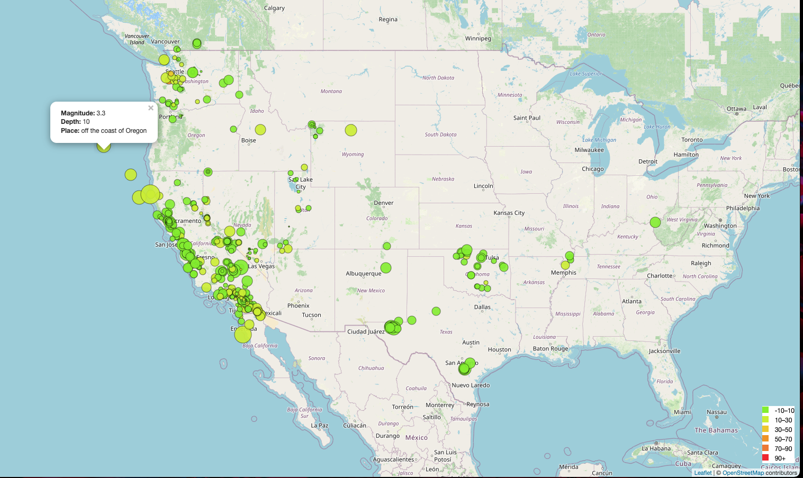

# Leaflet-Earthquake

This project uses USGS GeoJSON data to visualize and map all recorded earthquakes in the past 7 days.

**About the map:**

- Using OpenStreetMap and Leaflet, a map was created with markers that plot all the earthquakes from the dataset based on longitude and latitude.
- The size of the markers reflect magnitude(the larger the marker the higher the magnitude) and depth (earthquakes with greater depth are darker in color)
- Clickable pop-ups on markers provide information about the magnitude, depth, and location of the earthquake.
- The legend displays ranges of depth (measured in km) and corresponding color.

**Final result:**

Visit:https://samipete.github.io/Leaflet-Earthquake/ to explore the dataset!

